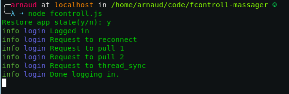
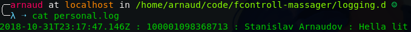

# FControl


## Abstract

A tool that helps you &ldquo;control stuff&rdquo; through the Facebook messages. Features of utility include:

-   Logging of all incoming messages
-   Saving a send by you to you image in some folder. You can just send some image to yourself and it will be saved on the computer where FControl is running
-   Logging when your friends are using Facebook &#x2013; basically, logging when does green dots in the sidebar are present
-   Logging any typing &#x2013; if someone is beginning to write a message to you and then stops and deletes is&#x2026; you will now about it.

 


### Yes, but why though?

There was that one Facebook [announcement](https://www.trustedreviews.com/news/facebook-messenger-unsend-delete-messages-3446074) that they will allow messenger&rsquo;s users to delete sent messages as if the weren&rsquo;t sent at all. Now I don&rsquo;t like this one bit! And also I am a software developer and can talk to computers so&#x2026; who cares what Facebook does, I have this app now and everything that is ever send to me will be saved.


### &rsquo;Muh Privacy

Yeaah, weeell, I don&rsquo;t know. The data is public and Facebook tracks me anyway. I am just part of the cabal by this point. At least I am tracking myself&#x2026; and the people who message me.


## Installation

You can clone the repository and install all *npm*-dependencies:

```sh
git clone https://github.com/palikar/fcontol
cd fcontol
npm install
```

Or if you want to whole thing to be a little more &ldquo;automatic&rdquo;, just install the package from [npm](https://www.npmjs.com/)

```sh
npm install fcontol
```


## Usage

A simple call with `node fcontol.js --help` gives:

    Description:
           A tool that logs different events coming from your facebook messanger (messages, typing, presence, attachments)
    Usage:
           fcontrol [options]
    
    Options:
           -e  --email        the email of your facebook acount
           -p  --pass         the password of your facebook acount
           --cli              use the tool only with command line arguments
           --restore-state    restore the state if a .appstate.json file is present
           --save-state       save the state of the app once logged in
           -h, --help         print usage information and exit
           -v, --version      show version info and exit

For first time usage, you can either just call `node fcontrol.js --save-state` which will prompt you for your username and password. After the first login, the application will save its state and you will no longer need to provide password and username.


If you don&rsquo;t want to run fcontrol in non-interactive mode, you&rsquo;ll have to use:

```sh
node fcontrol.js --save-state --cli -e <email> -p <pass> 
```


After the save is saved, fcontrol can easily be started with

```sh
node fcontrol.js --restore-state --cli
```


### Configuration

There are two configuration files. `lib/config.json` and `lib/folders.json`. `config.json` defines the single property `logging_dir` which points to a directory where the logs will be saved. `lib/config.json` can define several properties. I a message with the key of any property is received and the message contains an attachment, the attachment will be saved into the directory pointed by the property. For example, if I have defined the following configuration:

```json
{
    ":meme:" : "$HOME/memse"
}
```

and fcontrol is currently running, I can send and image to myself with the text &ldquo;This is :meme:&rdquo; and fcontrol will save the image into the directory `memes` inside my home directory.


### Service

I&rsquo;ve also written a small service file so that I can start FControl at boot time through [systemd](https://en.wikipedia.org/wiki/Systemd). Look at [fcontrol.service](fcontrol.service) and [install.sh](install.sh) so that you know what you install on your system. If you are comfortable with it, just run:

```sh
sudo ./install.sh
```

Then you&rsquo;ll be able to use commands like:

```sh
sudo systemctl start fcontrol # starting fcontrol
sudo systemctl stop fcontrol # stop fcontrol
sudo systemctl enable fcontrol # start fcontrol at boot
```
